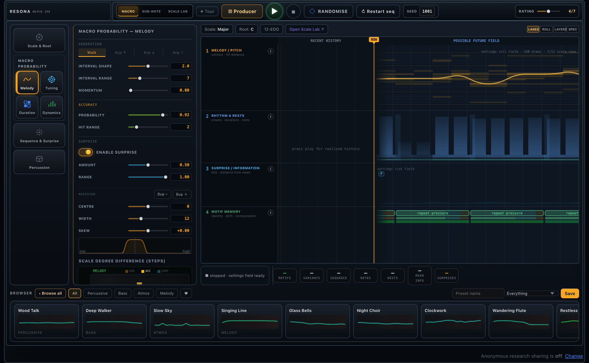
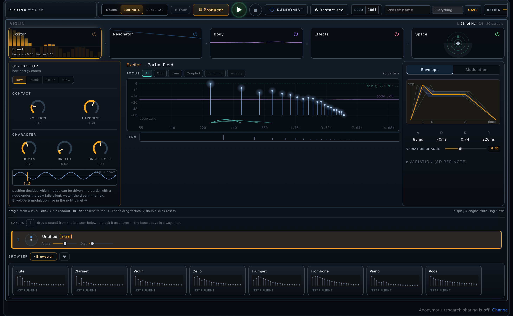
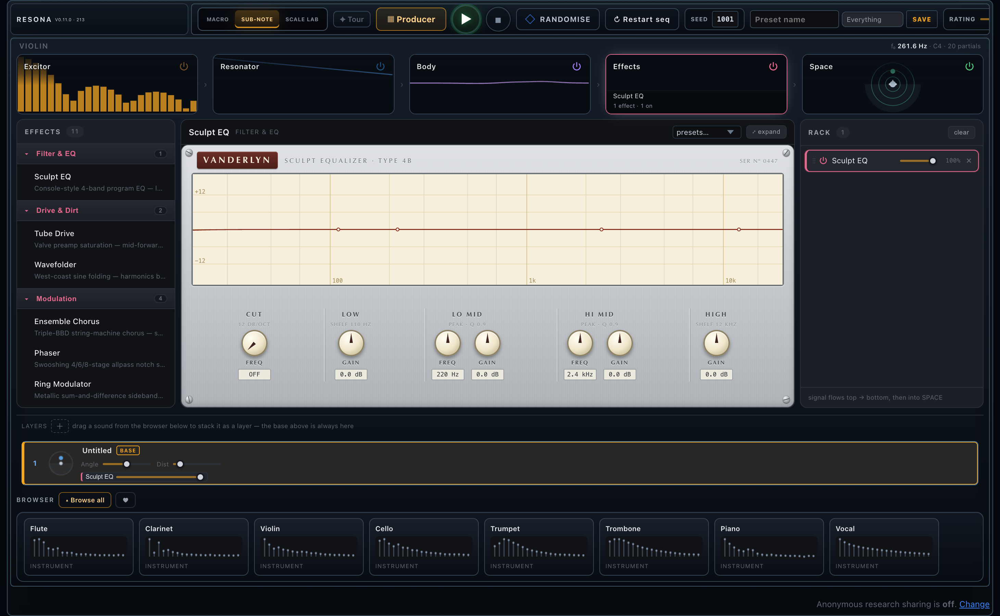
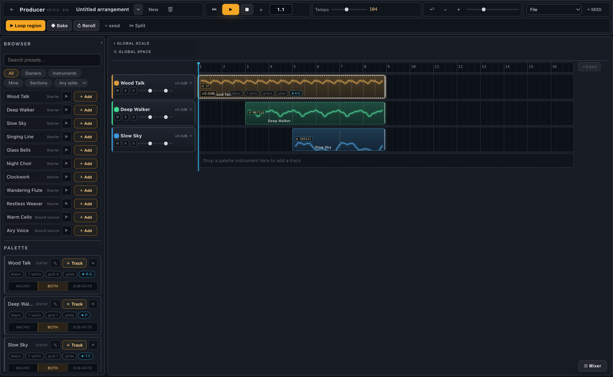
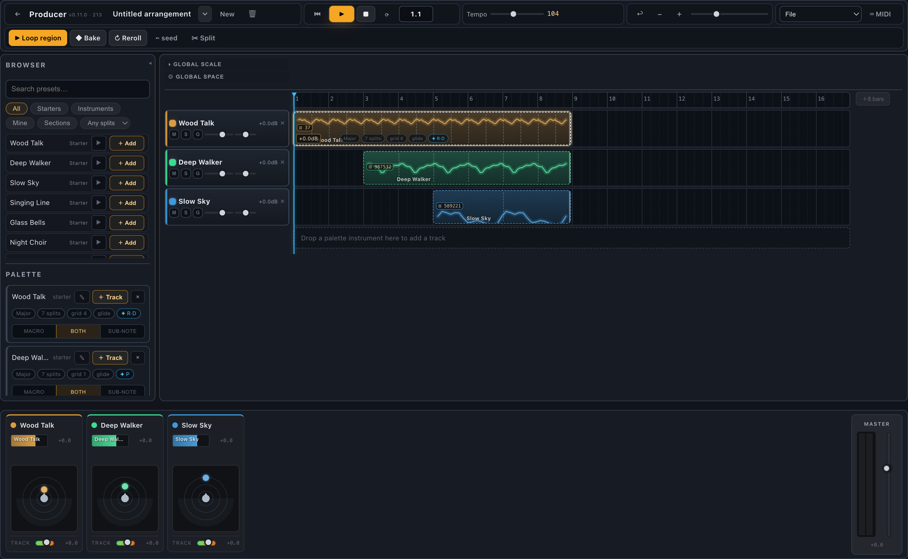

# Soundinator

**A probabilistic, physically-modelled music studio — for playing with, and researching, why music sounds good.**

Soundinator generates music from probability distributions across several
musical timescales, plays it through a physical-modelling synthesis engine, and
lets you arrange it on a full producer timeline. It doubles as a research
instrument: every sound is reproducible from a seed, and (only after a
plain-language opt-in) what listeners explore and how they rate it can be
logged for studying the aesthetics and mechanistic origins of music.

**Live at [thesoundinator.com](https://thesoundinator.com)** — early access,
invite-only while the first testing wave shakes it down.



---

## What it is

Two layers share one engine:

- a **browser studio** (Web Audio) where you design instruments, generate and
  arrange music live, and rate what you hear
- a **Python toolkit** for rendering reproducible WAV/JSON stimuli for
  lab-style experiments, and for hosting the studio with opt-in research logging

## Highlights

**Generative core** — melody, rhythm, register, articulation, rests and
percussion are all driven by editable probability distributions. Motifs repeat,
miss their target, drift in cents, or mutate at *surprise* events that can be
baked back into a growing repertoire. Hover any distribution to read the exact
per-note probabilities.

**Physical-modelling sound** — each note is built from an
excitor → resonator → body → **effects** → space chain. Fourier-additive and
formant voices, material damping, inharmonicity, partial macros, vibrato and
per-note envelope distributions give real instrumental behaviour rather than
samples. Layer several sub-notes into one voice.

**A real effects rack** — a per-layer effects stage with 11 skeuomorphic
effects across Filter/EQ, Drive, Modulation, Delay and Character — each a
self-contained plugin-style face with its own DSP, presets and expand-to-overlay
view.

**Binaural space** — position each source around the listener with a
head-model / room / air spatialiser (fitted from measured KEMAR HRTFs), per-track
threads through time, and a cross-section view.

**Microtonal Scale Lab** — N-EDO systems, world tunings, per-degree cents,
sub-scales and roots, with Scala import/export.

**Producer / DAW** — capture a voice as an instrument and arrange instruments on
a multitrack timeline: deterministic per-region seeded takes (with reroll),
generative regions that loop by motif, a bake-to-piano-roll note editor, a global
scale and a global space over time, arrangement JSON export and offline WAV
mixdown.

**Mixer** — a channel-strip mixer with per-region volume blocks, a per-track
position-in-space cross-section, track masters and an overall master fader +
stereo meter.

**Research-ready** — every play, rating, save and parameter change can be logged
(opt-in only) with a deterministic `stimulus_id`, and a per-performance summary
of expectation/surprise/repetition metrics (per-note surprisal under the
generative prior, information rate in bits/s, novelty and repetition ratios), so
appeal can be modelled directly against the mechanisms that generated the music.

---

## Screens

| | |
|---|---|
| **Tone designer** — the per-note synthesis chain and partial field | **Effects stage** — a per-layer rack of plugin-style effects |
|  |  |
| **Producer** — arrange instruments on a multitrack timeline | **Mixer** — channel strips, per-track space, master |
|  |  |

---

## Quick start

Python 3.11 or newer is required.

```bash
python3.11 -m venv .venv
source .venv/bin/activate
python -m pip install -e ".[dev]"
python -m pytest
```

Run the studio locally:

```bash
PYTHONPATH=src python -m synthesiser.web.server --host 127.0.0.1 --port 8765
```

Then open <http://127.0.0.1:8765>.

Audio runs live in the browser through Web Audio; the Python server handles
static hosting, shared preset storage, and optional server-side rendering.

## How it works

The engine is organised around probability distributions at several musical
timescales:

- **Scale & melody** choose the available pitch degrees and the likelihood of
  moving by different interval sizes.
- **Motifs** repeat, but notes can miss the expected target, drift in cents, or
  change at surprise events — which can be baked into the repertoire, growing the
  loop with remembered variants.
- **Rhythm** controls on-beat / off-beat starts, repeated durations, and rest
  ratios for motif starts, metrical notes and off-meter notes.
- **Articulation** samples around a zero line: positive values leave silence,
  zero/negative connect notes and can slide into the next pitch.
- **Sub-note** controls operate inside each sounded note — the excitor/resonator/
  body/effects/space chain, harmonic amplitudes, held-note drift, vibrato and
  ADSR variation.

Full parameter reference: [`docs/USER_MANUAL.md`](docs/USER_MANUAL.md).
Implementation overview: [`docs/HOW_IT_WORKS.md`](docs/HOW_IT_WORKS.md).

## Offline stimulus tools

The Python toolkit renders reproducible WAV/JSON sidecar stimuli for lab-style
experiments:

```bash
PYTHONPATH=src python -m synthesiser.cli render-mode-c --output stimuli/mode_c_demo --trials 3 --seed 42
PYTHONPATH=src python -m synthesiser.cli dry-run stimuli/mode_c_demo/mode_c_000.json
```

Each stimulus produces a WAV plus a JSON sidecar (seed, renderer, config, events,
trigger-ready tags, QC metrics) — the source of truth for reproducibility and
later EEG/lab alignment.

## Repository layout

```text
src/synthesiser/        Python package: generators, renderers, web server
web/static/             Browser studio: UI (app.js), Web Audio engine (synth.js),
                        effects modules (effects/), styles
web/data/               Local runtime data (git-ignored except .gitkeep)
web/cache/              Local rendered-audio cache (git-ignored)
docs/                   Design notes, user manual, hosting notes, screenshots
examples/               Small reproducible configuration examples
tests/                  Python test suite
```

Generated audio and web caches are intentionally not committed — they regenerate
from seeds, parameters, and sidecars. Local event logs and contributed presets
live under `web/data/`, which is git-ignored so participant/session data is never
published by accident. For public hosting, see
[`docs/DEPLOYMENT.md`](docs/DEPLOYMENT.md).

## Status

The browser studio is the most active part of the project — the generative
engine, sub-note tone designer, effects stage, spatial audio, Scale Lab, the
Producer timeline and mixer, and the opt-in research workflow are all
implemented. Some later lab components remain deliberately stubbed pending
hardware and validation decisions. See
[`docs/IMPLEMENTATION_STATUS.md`](docs/IMPLEMENTATION_STATUS.md) for the current
build status and caveats.

## Licence

See [`LICENSE`](LICENSE) if present; otherwise all rights reserved by the author
pending a licence decision.
